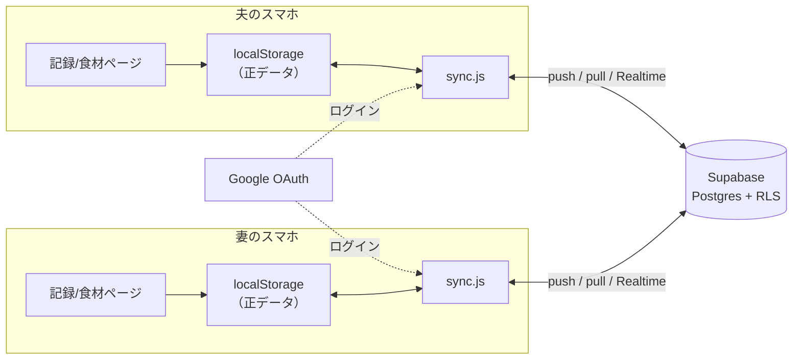

# 夫婦データ同期 設計書（Supabase + Googleログイン）

作成: 2026-07-11 ／ 状態: **設計レビュー中（実装未着手）**

## 1. 目的と要件

夫婦2人が、それぞれのスマホ・PCから**同じ記録データを閲覧・更新**できるようにする。

| # | 要件 | 備考 |
|---|------|------|
| R1 | 2人のGoogleアカウントでログインし、同一データを共有 | アカウントは2つのまま増やさない |
| R2 | オフラインファーストを維持 | 電波がなくても今まで通り記録でき、復帰後に自動同期 |
| R3 | ほぼリアルタイム反映 | 片方の記録がもう片方の画面に自動で現れる |
| R4 | 費用ゼロ | Supabase無料プラン・クレジットカード未登録で運用 |
| R5 | 公開リポジトリに秘密を置かない | 2人のメールアドレス等はSupabase側にのみ保持 |
| R6 | 既存アプリを壊さない | 同期未設定・未ログインでも従来通りローカル専用で動作 |
| R7 | 既存の技術方針を維持 | ビルドなし・フレームワークなし・`<script defer>` 直列読み込み |

## 2. 全体構成



方針: **localStorage を今後も「正」とし、Supabase は同期用の複製**とする。

- UI・集計・提案など既存コードは一切 localStorage しか見ない（変更最小）
- `sync.js` が背後で localStorage ⇄ Supabase を突き合わせる
- ログインしていなければ `sync.js` は何もしない（R6）

## 3. 技術選定

| 項目 | 選定 | 理由 |
|------|------|------|
| BaaS | Supabase（無料プラン） | カード未登録で課金が構造的に不可能。RLS。**「新規サインアップ無効化」設定がありFirebaseより閉じやすい** |
| 認証 | Google OAuth（Supabase Auth経由） | 夫婦とも既存のGoogleアカウントを利用。パスワード管理不要 |
| クライアントSDK | `@supabase/supabase-js` v2 の **UMDビルドを `vendor/supabase.js` として同梱**（バージョン固定） | CDN読み込みだとオフライン起動・将来のCSP（`script-src 'self'`）と衝突する。同梱ならSWでキャッシュでき、外部依存ゼロの方針も維持（MITライセンス、`vendor/` にライセンス表記を同梱） |
| リアルタイム | Supabase Realtime（postgres_changes購読） | 無料枠内。切断時は60秒ポーリングにフォールバック |

## 4. データモデル

### 4.1 同期対象（全6ストア）

すべて **id で行単位に分解**して同期する。単位が細かいほど夫婦の同時更新が衝突しない。

| store名 | localStorageキー | 行の単位（id） | data（jsonb）の中身 | 競合解決 |
|---------|------------------|----------------|----------------------|----------|
| `entries` | eiyokanri.entries.v1 | entry.id | entryオブジェクト全体 | LWW（実質は追記＋削除のみで衝突しない） |
| `milk` | eiyokanri.milk.v1 | feed.id | feedオブジェクト全体 | 同上 |
| `foodStates` | eiyokanri.foodStates.v1 | foodId | `{ "state": "introduced" }` | foodIdごとにLWW |
| `mealTemplates` | eiyokanri.mealTemplates.v1 | template.id | templateオブジェクト全体 | LWW |
| `foodPrefs` | eiyokanri.foodPrefs.v1 | foodId | `{ "unit": "g", "amount": 15 }` | foodIdごとにLWW（実害の小さい統計情報） |
| `customFoods` | eiyokanri.customFoods.v1 | food.id | foodオブジェクト全体 | LWW |

LWW = Last Write Wins（`updated_at` が新しい方を採用）。

補足（customFoodsのid）: 食品データベースから追加した食材のidは `db_${foodNo}` で**食品番号から決定的に生成**される（`foods.js` の `addFoodFromDb`）。そのため初回同期前に夫婦が独立に同じDB食材を追加していても、両者とも同じidになり自動的に1件へ収束する（中身も同一の公式値なのでLWWでどちらが残っても実害なし）。手入力食材のidは `custom_${Date.now()}-${乱数}` で衝突しない。

### 4.2 テーブル定義（Supabase側・SQL全文）

Phase 0 でダッシュボードのSQL Editorから適用する。前提として、プロジェクト設定の「Automatically expose new tables」はOFF、「Enable automatic RLS」はONにしておく（新規テーブルへの自動権限付与を止め、RLS有効化は保険として自動化する）。OFFにした分、`sync_items` への権限は下記SQLで明示的に付与する。

```sql
-- 同期データ本体。全ストアを1テーブルに集約（store, id で一意）
create table public.sync_items (
  store      text        not null,
  id         text        not null,
  data       jsonb,
  deleted    boolean     not null default false,  -- 削除の墓標（tombstone）
  updated_at timestamptz not null,                -- クライアントの変更時刻（LWW判定用）
  updated_by text        not null,                -- 変更者メール（デバッグ用）
  primary key (store, id)
);

-- 許可メンバー（夫婦2人のメール）。クライアントからは一切アクセス不可
create table public.members (
  email text primary key
);
alter table public.members enable row level security;
-- members にはポリシーを作らない = APIからは誰も読めない（登録はダッシュボードから行う）

-- 呼び出し元がメンバーかを判定（security definer で members を参照）
create or replace function public.is_member()
returns boolean
language sql stable security definer
set search_path = public
as $$
  select exists (
    select 1 from public.members
    where email = (auth.jwt() ->> 'email')
  );
$$;

alter table public.sync_items enable row level security;

create policy "members can select" on public.sync_items
  for select to authenticated using (public.is_member());
create policy "members can insert" on public.sync_items
  for insert to authenticated with check (public.is_member());
create policy "members can update" on public.sync_items
  for update to authenticated using (public.is_member()) with check (public.is_member());
create policy "members can delete" on public.sync_items
  for delete to authenticated using (public.is_member());

-- Realtime 配信対象に追加（postgres_changes は RLS を尊重する）
alter publication supabase_realtime add table public.sync_items;

-- 「Automatically expose new tables」をOFFにしたため、Data API用の権限を明示付与する。
-- authenticated のみに付与し、anon には一切付与しない（RLSと合わせた二重の防御）。
-- members は意図的に権限を付与しない = Data APIからは存在ごと見えない。
grant select, insert, update, delete on public.sync_items to authenticated;

-- メンバー登録（実際のメールはダッシュボードでのみ入力。リポジトリに書かない）
-- insert into public.members (email) values ('（夫のGmail）'), ('（妻のGmail）');
```

削除は物理削除せず `deleted = true` の墓標を残す。これがないと「端末Aで削除→端末Bの手元コピーが再同期で復活」が起きる。

## 5. 認証設計

- `supabase.auth.signInWithOAuth({ provider: "google" })` のリダイレクト方式（ポップアップ不使用。iOS Safari/PWAで確実に動く方式を採る）
- セッションはSDKがlocalStorageに保持し自動リフレッシュ。ログインは端末ごとに初回1回
- ログイン導線は食材ページの「同期」パネルに置く（設定作業は初回のみのため、記録ページは汚さない）

Supabase側の設定（Phase 0 チェックリスト）:

1. Google Cloud ConsoleでOAuthクライアント作成（承認済みリダイレクトURIにSupabaseのcallback URLを登録）
2. SupabaseのAuth設定にGoogleのクライアントID/シークレットを登録
3. **Redirect URLs** を `https://tomatokun-dayo.github.io/eiyokanriapp/*` と `http://localhost:4173/*`（開発用）のみに限定
4. 夫婦それぞれ一度ログインしてアカウントを作成
5. `members` テーブルに2人のメールを登録
6. **「Allow new users to sign up」をオフ**（以後、第三者はログイン自体が不可）

## 6. 同期エンジン（sync.js）

### 6.1 配置と読み込み

- 新規ファイル: `sync-config.js`（接続情報）、`vendor/supabase.js`（SDK同梱）、`sync.js`（エンジン本体）
- 両ページの `<script defer>` 列に追加: `sync-config.js` → `vendor/supabase.js` → …既存… → `store.js` → `sync.js` → `app.js`/`foods.js`
- `sync-config.js` の `SUPABASE_URL` / `SUPABASE_ANON_KEY` が空文字なら sync.js は完全に休眠（R6。リポジトリをcloneした第三者はローカル専用アプリとして使える）

### 6.2 変更の捕捉

store.js / custom-foods.js の各書き込み関数の末尾に1行ずつフックを足す:

```js
notifySyncChange(store, id, data);   // 追加・更新
notifySyncChange(store, id, null);   // 削除（墓標化）
```

`notifySyncChange` は sync.js が未読込・未ログインなら何もしないグローバル関数。対象は `addEntry` / `addEntries` / `removeEntry` / `resetToday` / `addFeed` / `removeFeed` / `setFoodState` / `remember` / `addTemplate` / `removeTemplate` / `addCustomFood` / `removeCustomFood` と、各 `replaceAll*`（バックアップのインポート。旧集合との差分から追加・墓標を算出する）。

### 6.3 ローカルメタデータ

`eiyokanri.sync.v1` に保持（データ本体は二重に持たない）:

```json
{
  "lastPulledAt": "2026-07-11T09:00:00.000Z",
  "queue": [ { "store": "entries", "id": "xxx", "deleted": false, "updatedAt": "…" } ],
  "deviceId": "ランダム生成"
}
```

queueは「未送信の変更のid一覧」。data本体は送信時にlocalStorageから読む（墓標は `deleted: true` のみ送る）。

### 6.4 同期サイクル（pull → merge → push）

1. **pull**: `updated_at > lastPulledAt` の行を取得
2. **merge**: 各行についてローカルのqueue内 `updatedAt` と比較し、リモートが新しければlocalStorageへ適用（`deleted` なら削除）→ 適用したidはqueueから除去 → `render()` で再描画。`lastPulledAt` を更新
3. **push**: queueに残った変更を `upsert`（onConflict: store,id）でまとめて送信 → 成功したらqueueを空にする

pullを先に行うことで「古い変更が新しいリモート行を潰す」逆転を防ぐ（クライアント側LWW）。夫婦2人の運用ではこれで十分で、将来厳密化が必要になればサーバー側関数（updated_at比較つきupsert）に差し替える。

### 6.5 起動タイミング

| トリガー | 動作 |
|----------|------|
| ページ読み込み時（ログイン済みなら） | フル同期サイクル |
| ローカル変更後 | 3秒デバウンスでpush（連続入力をまとめる） |
| Realtime購読（sync_itemsのINSERT/UPDATE） | 即時pull |
| `visibilitychange`（アプリに戻った時）/ `online`（回線復帰） | フル同期サイクル |
| Realtime切断中 | 60秒間隔ポーリングにフォールバック |

### 6.6 初回ログイン時（既存データの合流）

- ログイン成功後、全ストアの全idをqueueに積んでフル同期サイクルを実行
- 両端末に既存データがあっても **和集合**になる（idが異なるため上書き消失は起きない）
- 片方にしかデータがない現在の実態では「夫がログイン→全push、妻がログイン→全pull」となり手作業ゼロ

## 7. セキュリティ設計

| 脅威 | 対策 |
|------|------|
| 勝手に課金される | **カード未登録の無料プラン**。超過時は同期が止まるだけで請求は発生し得ない |
| 第三者によるデータの読み書き・容量消費 | 全テーブルRLS有効。`members`（2人のメール）に載っていない認証者は全操作拒否。拒否されたリクエストはDB容量を消費できない |
| アカウント大量作成の嫌がらせ | 2アカウント作成後に**サインアップ無効化** → ログイン自体が不可 |
| 認証フローの成りすまし利用 | Redirect URLs を本番URLと `localhost:4173` に限定 |
| リポジトリからの情報漏えい | コミットするのは `SUPABASE_URL` と `SUPABASE_ANON_KEY` のみ（**公開前提の設計値**。守りはすべてRLS側）。2人のメールアドレスはSupabaseダッシュボードでのみ入力し、リポジトリ・コードには書かない |
| 同期データ経由のstored XSS | 相手端末から届く食材名・記録IDなどを `innerHTML` へ入れる前に `escapeHtml()` で必ずエスケープ（`app.js`）。加えて `<meta>` CSP（`script-src 'self'`）で第二の防御層 |

補足:

- anonキーはFirebaseのapiKeyと同様「プロジェクトの住所」であり、秘密鍵ではない。RLS＋サインアップ無効化により、キーを知っていてもできることは「ログイン画面で弾かれる」のみ
- **CSP実装済み**: `index.html` / `foods.html` に `<meta http-equiv="Content-Security-Policy">` を設置。`connect-src` に Supabase の https/wss を列挙（`sync-config.js` の URL と一致させる）。`script-src 'self'` を成立させるため SW 登録のインラインスクリプトを `register-sw.js` へ切り出し済み。`style-src` は描画コードの `style="..."` 属性のため `'unsafe-inline'` を許可、`worker-src blob:` は将来の Realtime 用
- **将来の堅牢化（未実装）**: `is_member()` の判定を `email` クレームから `auth.users.id`（UUID）に切り替えると、別の認証プロバイダを追加した際の「未検証メール成りすまし」を構造的に防げる。サインアップ無効化が効いている限り現状の email 判定でも安全

## 8. UI設計

### 食材ページ（foods.html）— 「同期」パネルを新設（バックアップパネルの上）

- 未設定時（sync-config空）: パネル自体を非表示
- 未ログイン: 説明文＋「Googleでログイン」ボタン
- ログイン済み: 状態表示（`✓ 同期済み（HH:MM）` / `同期中…` / `オフライン（復帰後に自動同期）` / エラー内容）、「今すぐ同期」ボタン、ログアウト
- 免責の並びに「同期データはSupabase（自分たちのプロジェクト）に保存されます」の注記

### 記録ページ（index.html）— ヘッダーに状態ドットのみ（Phase 2）

- ●同期済み ／ ●オフライン ／ （未ログイン時は非表示）。タップで食材ページの同期パネルへ

## 9. PWA / Service Worker への影響

- `sw.js` の `APP_SHELL` に `sync-config.js` / `vendor/supabase.js` / `sync.js` を追加し、`CACHE_VERSION` を v6 へ
- Supabase APIはクロスオリジンのため、既存fetchハンドラ（同一オリジンGETのみ処理）に**変更不要**。API呼び出しがSWのstale-while-revalidateに巻き込まれる事故は構造的に起きない

## 10. 実装フェーズ

| Phase | 内容 | 完了条件 |
|-------|------|----------|
| **0. Supabase準備**（コード変更なし） | プロジェクト作成／Google OAuth設定／§4.2のSQL適用／2人ログイン→members登録→サインアップ無効化／Redirect URLs限定 | 2人がログインでき、3人目（members未登録）がRLSで拒否されること |
| **1. 手動同期** | vendor SDK同梱、sync-config、認証UI（食材ページ）、「今すぐ同期」でフル同期サイクル、store.jsフック追加 | 2ブラウザプロファイル（2アカウント）間で記録・削除・食材状態が相互反映 |
| **2. 自動化** | デバウンスpush／Realtime購読／visibility・onlineトリガー／記録ページ状態ドット／replaceAll系の差分同期 | 片方で記録→他方が無操作で反映。オフライン記録→復帰で自動同期 |
| **3. 磨き込み** | エラー表示の整備、墓標の間引き（例: 90日超）、必要なら厳密LWWのサーバー関数化 | 通常運用で同期に関する操作・意識が不要 |

各Phase完了時に `node --check`、ローカル2プロファイル検証、コミット＆Pages反映確認を行う。

## 11. 制約と注意（了承のうえで採用）

- **時計ずれ**: `updated_at` は端末時計。夫婦が同一項目（同じ食材の状態など）を数秒差で更新した場合の勝敗が時計精度に依存する。記録(entries/milk)は追記型で衝突しないため、実害は限定的と判断
- **無料プランの自動一時停止**: Supabase無料プロジェクトは約1週間APIアクセスがないと一時停止する。毎日使う想定では顕在化しないが、長期の帰省・旅行後は初回同期が失敗することがある（ダッシュボードで再開すれば復旧。ローカル記録は失われない）
- **同期停止時の挙動**: 無料枠超過・一時停止のいずれでも、アプリはローカル専用として動き続ける（R2/R6）
- **バックアップJSONの役割は継続**: 同期はバックアップの代替ではない。エクスポート機能は残す

## 12. 保留事項（実装しながら判断）

- 記録ページ状態ドットの見た目（Phase 2で調整）
- 墓標の間引き期間（暫定90日）
- `foodPrefs` の同期を外すか（端末ごとの入力癖として残す選択肢もある。初期実装では同期に含め、違和感があれば外す）
